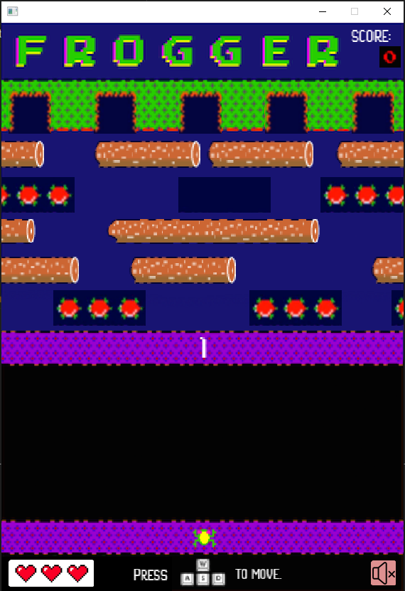

# COMP2042_CW_Ng Jiun Loong

This is a documentation of the work I have done on this Assignment.

### Table of Content
1. Code Refactoring
   
    a. Rename Variables, Classes and Methods
   
   b. Extract Long Code into Methods

    c. Remove Unused Code and Methods
   
   d. Add Javadocs and Comment
   

2. Additions
   
   a. Life System

    b. Game Level System

   c. Game Menu

   d. Mute/Unmute Button

### 1. Code Refactoring
##### a. Rename Variables, Classes and Methods
I have renamed several variables and methods throughout the project, but the most noticeable one will be the Frogger Class where i changed the class name from Animal to Frogger, and i have also changed Image variables' name to a more relevant name. For example, it was named imgW1, imgA1.... but i changed them to facingUp, movingDown.... . I have also changed the methods name to make them more readable and make them sounds like an action. For Instance, generateLevel(), resetLocation(), updateLifeBar() and etc.
The reason of doing this is just to make the code more readable and easier to comprehend. Instead i, x, y, we can use isMusicPlaying, canMove, currentLevel to better represent what the variables hold.
##### b. Extract Long Code into Methods
In the Turtle class, I have extracted the code that is related to reset location of the turtle into a method and named it resetTurtleLocation. Furthermore, I extracted a block of code which is repeated 2 to 3 times and is related to what happen after frogger dies into a method called deathAction(). And there are some other examples in other classes where I didn't elaborate. The purpose of doing this is pretty similar to what renaming variables/methods name does, just to make the code more readable and self-explanatory.
##### c. Remove Unused Code and Methods
There are several blocks of commented code and unused code in some classes, and I have removed those to de-clutter and make the code abit cleaner.
##### d. Add Javadocs and Comment
I have added Javadocs to the long methods to explain what the method does and what parameters it takes. The comment feature is also frequently used in the project to explain what a block of code or even a method does.

### 2. Additions
##### a. Life System
The life system is implemented for this game where the frogger only has 3 lives and everytime it dies, it will reduce a heart from the health bar which indicates the current lives you got shown in the left bottom corner of the game. This feature is implemented to increase the difficulty of the game and make the game "shorter" for the player, so they don't have to play through level 10 to stop the game.
##### b. Game Level System
The game level system is implemented to increase the game difficulty as the player play through the game to make the game more challenging. There are total of 10 levels in this game, different level consists of different layout of obstacles.
##### c. Game Menu
The game menu is created to provide a more user-friendly way of starting the game, more information related to the game can also be found via About page and also let player to be ready before the actual game starts.
##### d. Mute/Unmute Button
A mute/unmute button does what the name suggest, mute and unmute the background music if you find the background music is too annoying like i do. :)